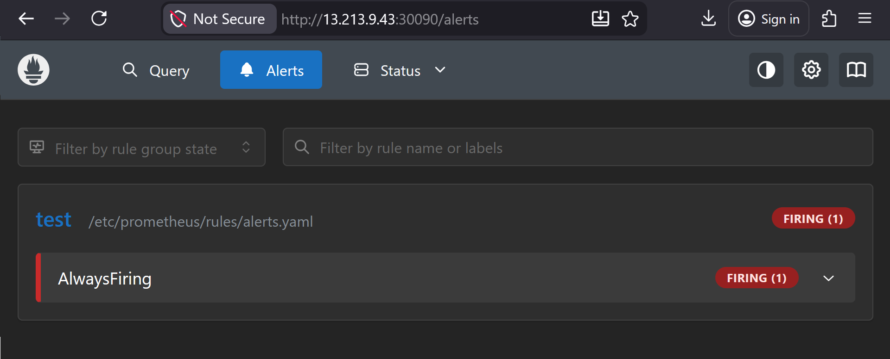

# Kubernetes Bootstrap + Prometheus Deployment

This repo is end-to-end Kubernetes bootstrap and monitoring setup following DevOps best practices.

It leverages:
- Packer to build a hardened golden AMI
- Terraform to provision AWS infrastructure
- kubeadm to initialize the Kubernetes cluster
- Helm to deploy Prometheus with a custom chart

Prometheus is configured using separated ConfigMaps for configuration 
and alert rules, enabling dynamic updates and observability validation.

---

## Architecture Overview

- Image Layer → Packer (Golden AMI)
- Infrastructure Layer → Terraform (AWS EC2)
- Cluster Layer → Kubernetes (kubeadm + Calico)
- Application Layer → Helm (Prometheus)
- Observability Layer → Prometheus Alerts

---

## Deployment Steps

1. Initialize Kubernetes cluster
2. Configure kubectl
3. Install CNI (Calico)
4. Install Helm
5. Deploy Prometheus
6. Update ConfigMap
7. Verify deployment

---

## Usage

### Prerequisites
sudo yum install -y git
curl https://raw.githubusercontent.com/helm/helm/main/scripts/get-helm-3 | bash

### Clone Repository
git clone https://github.com/RodzonLimjapV/k8s-bootstrap-repo-prometheus-chart.git
cd k8s-bootstrap-repo-prometheus-chart

### Run Scripts

#### 1. Make Scripts Executable
```bash
chmod +x scripts/*.sh
```

#### 2. Initialize Kubernetes Cluster
```bash
./scripts/01-init-cluster.sh
```

#### 3. Configure kubectl
```bash
./scripts/02-configure-kubectl.sh
```

#### 4. Install CNI Plugin
```bash
./scripts/03-install-cni.sh
```

#### 5. Install Helm
```bash
./scripts/04-install-helm.sh
```

#### 6. Deploy Prometheus
```bash
./scripts/05-deploy-prometheus.sh
```

#### 7. Allow Workloads on Control Plane (Optional)
```bash
kubectl taint nodes --all node-role.kubernetes.io/control-plane-
```

#### 8. Verify Monitoring Resources
```bash
kubectl get pods -n monitoring
kubectl get svc -n monitoring
```

#### 9. Update ConfigMap (if needed)
```bash
./scripts/06-update-configmap.sh
```

#### 10. Final Verification
```bash
./scripts/07-verify.sh
```


## Access Prometheus

http://< EC2-PUBLIC-IP >:30090  
http://< EC2-PUBLIC-IP >:30090/alerts

---

## Screenshots



---

## Validation Checklist

- Kubernetes cluster initialized
- Node status = Ready
- Prometheus deployed via Helm
- ConfigMap separated (config + rules)
- ConfigMap updates applied dynamically
- Alert rule triggered → FIRING

---

## Security

- SSH key-based access only
- Password authentication disabled
- secadmin user with sudo privileges

---

##  Summary

This project is a complete DevOps lifecycle from infrastructure provisioning 
to Kubernetes deployment and monitoring.
